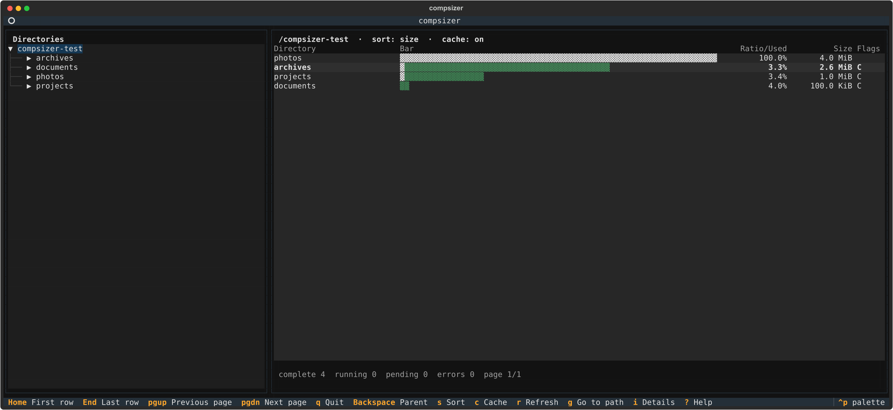

# Compsizer

Find which folders use disk space without waiting for a full scan. Compsizer is
a keyboard-driven terminal browser for Linux Btrfs and Windows NTFS. Folder
names appear first; size results fill in as scans finish.



## Why use it?

- **Keep browsing while it scans.** Compsizer measures folders in the
  background and shows results as they arrive.
- **See compression at a glance.** Size bars show allocated space and savings.
  Btrfs scans show compression data; NTFS scans compare logical size with
  allocated space and flag compressed or sparse files.
- **Jump straight to a folder.** Enter an absolute or relative path, or find a
  child folder by typing part of its name.
- **Scan NTFS safely.** Windows scans read file metadata, not file contents.
  They do not change compression settings, and hard-linked files count once.

## Requirements

- Python 3.11 or newer and [`uv`](https://docs.astral.sh/uv/).
- A terminal that supports interactive text apps. `uv` installs the app's
  Textual dependency when you run it; no separate install step is needed.
- **Linux:** Btrfs and `compsize` are needed for Btrfs compression data. If a
  scan needs more permission, Compsizer asks before running `compsize` with
  `sudo`; the app itself never runs as root. If you decline, GNU `du` from
  coreutils is needed for estimates.
- **Windows:** Windows 10 or newer. NTFS volumes provide size data; other
  filesystems can be browsed without size data. The standard Command Prompt
  (`cmd.exe`) is supported.

## Run it

From the project folder, start in the current directory:

```console
uv run --script compsizer.py
```

On Linux, pass a starting folder:

```console
uv run --script compsizer.py "$HOME/Videos"
```

On Windows, run the same command from `cmd.exe`:

```bat
uv run --script compsizer.py "C:\Users\Ada\Videos"
```

To append diagnostic logs, including debug details, to a UTF-8 file:

```console
uv run --script compsizer.py --log-file compsizer.log
```

Log files may include full filesystem paths.

## Use it

| Key                      | Action                                                             |
| ------------------------ | ------------------------------------------------------------------ |
| `Up` / `Down`, `j` / `k` | Select a folder                                                    |
| `Enter` or `l`           | Open the selected folder                                           |
| `Backspace` or `h`       | Go to the parent folder                                            |
| `Home` / `End`           | Go to the first or last folder on the page                         |
| `PageUp` / `PageDown`    | Change directory pages                                             |
| `Tab`                    | Switch panes; in the path prompt, complete the selected suggestion |
| `g`                      | Enter a path or search up to 100 child folders                     |
| `i`                      | Show details for the selected folder                               |
| `a`                      | Show About and license                                             |
| `s`                      | Change sorting: size, ratio, savings, or name                      |
| `r`                      | Refresh the current folder and its measurements                    |
| `c`                      | Turn the in-memory result cache on or off                          |
| `?` / `q`                | Show help / quit                                                   |

**Example:** press `g` and edit the path to `../Photos` or
`C:\Users\Ada\Photos`. To find a child folder, keep its parent path and type
part of the folder name. Use `Up` and `Down` to choose a match, then press
`Tab` to complete it. `Enter` opens the path in the input. Press `Esc` to
cancel. For a network share, add a backslash after the share name to suggest
its child folders, for example `\\server\share\`.

## Read the results

- On Btrfs, `compsize` reports uncompressed extent sizes. A `~` marks a `du`
  estimate instead of an exact Btrfs measurement.
- On NTFS, `Logical Size` is the file's logical size. `Stored/Logical` compares
  allocated space with logical size; sparse files can affect this ratio.
- The flags are `C` for compressed data found, `S` for sparse NTFS files, and
  `?` when compression status is unknown. Press `i` for scan details.

## Limitations

- Compsizer lists folders, not individual files.
- Exact compression data is available for Btrfs on Linux and NTFS on Windows.
  Other Windows filesystems remain browsable but have no size measurements.
- `du` results are estimates, not Btrfs extent statistics. Btrfs folders can
  share extents, so their measurements may overlap and should not be added as a
  unique total.
- On Windows, directory links and junctions are browsable but skipped when
  measuring their parent folder.
- Results are cached only while Compsizer is running. Press `r` to refresh after
  files change.

## Run the tests

```console
uv run --with textual python -m unittest discover -s tests -v
```

## License

Copyright (C) 2026 Christoph Haunschmidt. Compsizer is licensed under the
[GNU General Public License v3.0 or later](LICENSE).
